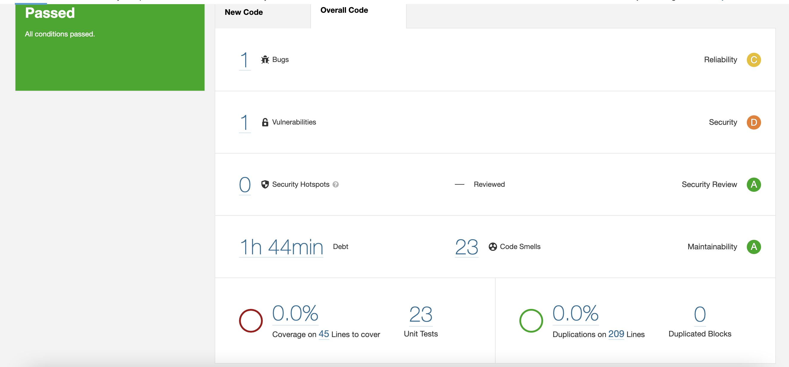
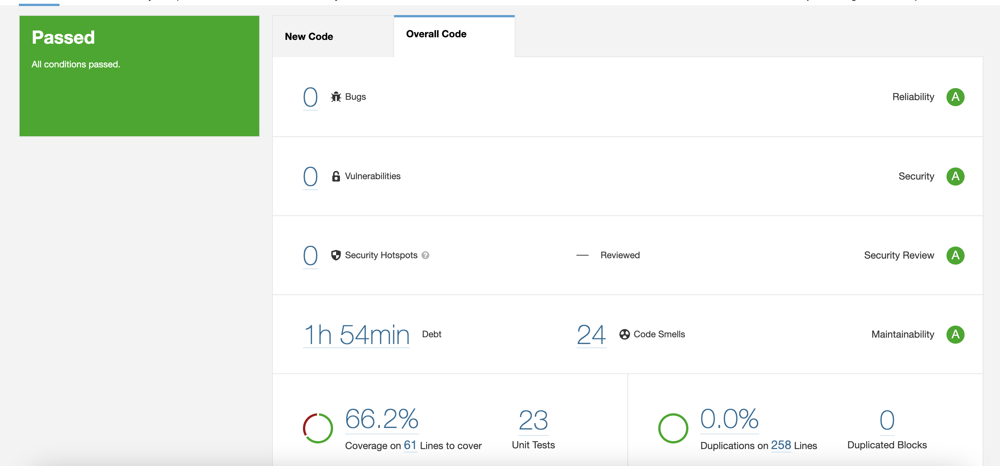
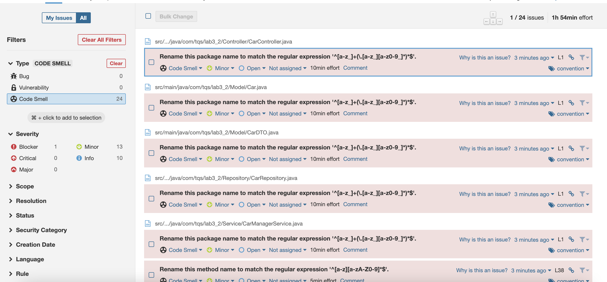
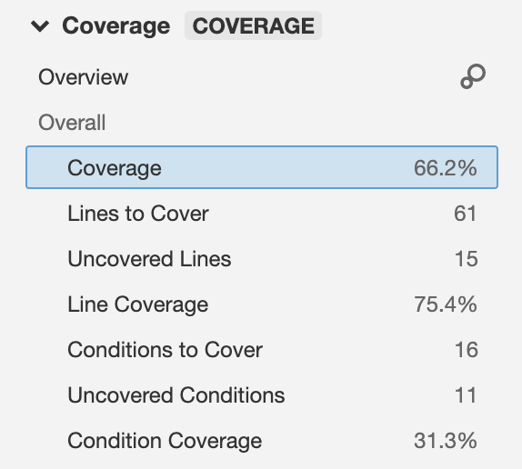

<h1>Lab 6_3 - Technical Debt (Cars)</h1>


Command to run:

```bash
$ mvn verify sonar:sonar -Dsonar.host.url=http://localhost:9000 -Dsonar.projectKey=lab6_3 -Dsonar.login=e551c1d6769ee5f5abd8d087f095bcd490fa535b
```

For this exercise I it was asked to use the Cars project (Lab3_2).


<h3>Did the project pass the defined quality gate?</h3>

Yes it did!

<h3>What was the technical debt found? And what is it?</h3>

1h44 minutes. The techincal debt is the ammount of time one is expected to take to solve every code smell the sonar detected.


<h2>Print of the Sonar Dashboard</h2>




<h2>Analysing and fixing the issues</h2>

Analysis after the correction of the bug and the vulnerability. In the example above coverage was not appearing because Jacoco Plugin was not installed.



Even though we still have 24 Code Smells, none of them is Critical or Major.




<h3>Analysing the coverage</h3>

There is 66.2% of overall coverage.

There are 15 uncovered lines and 11 uncovered conditions.




