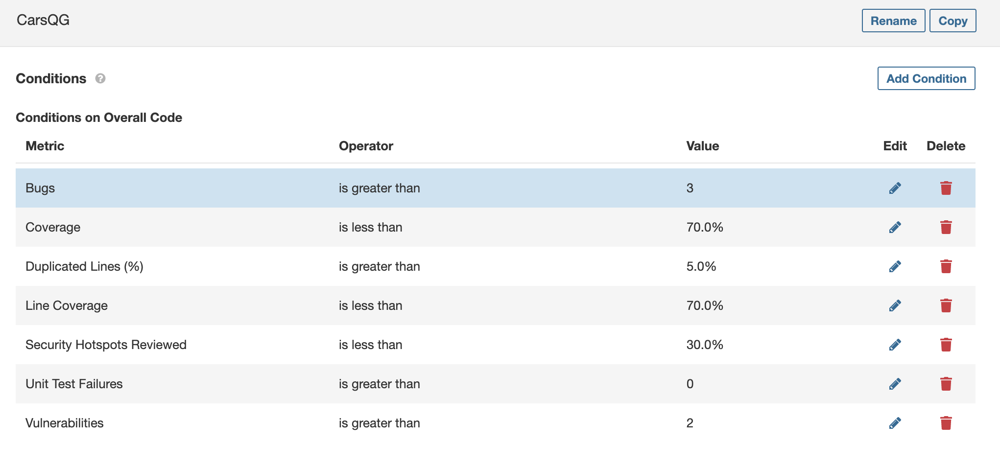
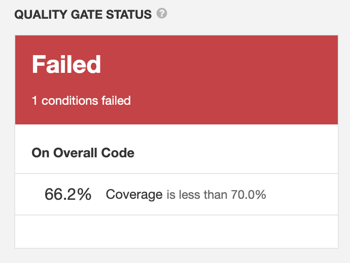

<h1>Lab 6_4 - Custom QG</h1>

In this exercise I also used the Car project from the previous exercise.

This was the Quality Gate configuration I chose:

I think the reasonable amount of bugs is 3 because more than that can put the integrity of the system at stake.

There should not be more than 5.0% of duplicated lines of code since code should never be repeated.

Line coverage should always be above 70% because the code needs to be well tested. We're giving away 30% because there are some methods, normally the default ones, that don't need to be tested.

There should not be more than 2 vulnerabilities because it can severely compromise the security of the project.

There should not be any unit test failures because unit tests are what ensures the correct functioning of the project.

<h3>Running the project analysis again</h3>

When running the project analysis again, we verify that it fails because it doesn't have the minimum required coverage to pass.

